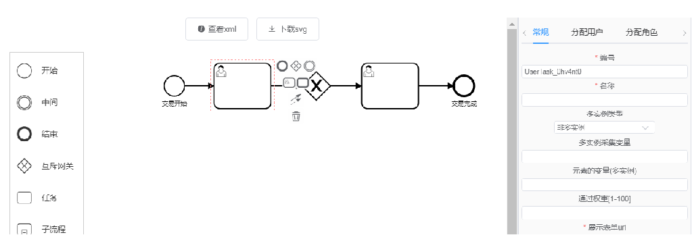
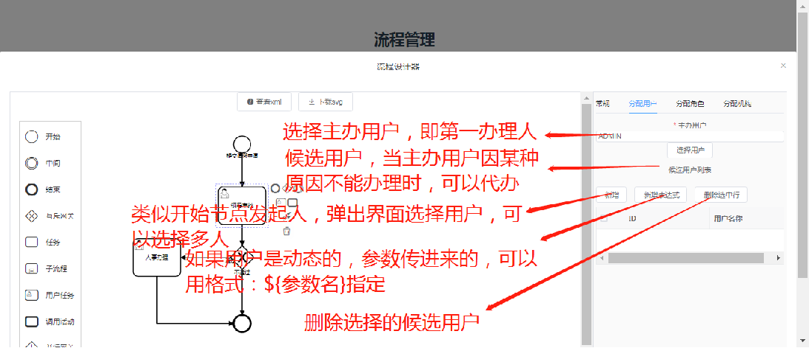

# vue-activiti-design

#### 介绍
vue版 act6工作流设计器
Activiti6是由Alfresco软件在2010年5月17日发布的业务流程管理（BPM）框架，它是覆盖了业务流程管理、工作流、服务协作等领域的一个开源的、灵活的、易扩展的可执行流程语言框架。Activiti基于Apache许可的开源BPM平台，创始人Tom Baeyens是JBoss JBPM的项目架构师，它的特色是提供了eclipse插件，开发人员可以通过插件直接绘画出业务流程图。

#### 软件架构
软件架构说明
工作流及集成系统拓扑图

如有问题可以加我微信号或扫码：
lita2lz

工作流及集成系统拓扑图
根据目前技术路线，该拓扑图，分成四个子系统:
  
1.  工作流后台系统，负责提供维护工作流接口及运行工作流引擎，负责导向工作流节点定义页面url，
     负责调用工作流节点配置外部系统接口（业务后台系统)。和其他三个系统都有交互。它不关心业务功能，专注于工作流节点推进。
2.  工作流设计系统，基于vue。基于bpmn .js 实现的可视化工作流设计。读取和提交工作流时和工作流后台系统交互。
3.  业务后台系统，负责提供工作流后台系统调用的接口实现（微服务)。理论上这样的业务后台系统可以有任意多个,工作流节点都能配置对接上。由工作流后台系统根据工作流节点配
    置，触发调用接口。它不关心工作流功能，专心做业务功能实现
4.  业务前台系统，基于vue。为工作流提供对应工作流节点业务页面展示。理论上这样的业务前台系统可以有任意多个，工作流系统都能无缝衔接。由工作流后台系统根据工作流节点配
    置，自动重定向到展示页面。

工作流及集成系统拓扑图
优点：
   1。这样设计的好处，是完全解耦。业务系统不一定用工作流，随时可以去掉和加上工作流功能。
         工作流后台系统升级，对工作流设计系统影响降到最低。
   2。工作流对外部接口(微服务)暂时提供Reset API方式。由于Reset API  的开发语言无关性。工作流能无缝和其他语言开发系统集成，无论新旧技术路线系统框架都集成。上图中业务前台系统vue，换成其他（如：beetl,jsp）一样可以。
  3。 其他接口协议，根据需要陆续加上。

工作流流程设计及部署—新建流程

工作流流程设计及部署—录入流程基本信息

工作流流程设计及部署----设计流程

工作流流程设计及部署----设计流程

工作流流程设计及部署----流程属性

工作流流程设计及部署--提交服务
定义工作流节点调用外部系统接口， 以完成工作流关联的业务处理。

工作流流程设计及部署--提交服务
点击新增按钮，出现如下图：
参数页签，用来定义请求参数一个些选项

工作流流程设计及部署--提交服务
点击Body Data，出现如下图：

工作流流程设计及部署--提交服务
点击请求头，出现如下图：
请求头用来定义请求时，头部附带信息。一般情况下，不用定义

工作流流程设计及部署--提交服务
点击应答页签，出现如下图：
它定义了应答一些选项，方便框架进行判断处理。

工作流流程设计及部署---工作流节点配置(开始节点)
点击开始节点，在右边出现属性框，各项作用如下图，开始节点没有界面，所以不用指定界面url,
但是它要启动流程，产生流程实例，流程实例要与具体业务数据绑定，所以业务应用需要提供产生业务主键接口。

工作流流程设计及部署---工作流节点配置(开始节点)
开始节点，可以指定发起人，点击选择用户，如下图：

工作流流程设计及部署---工作流节点配置(请假申请，用户任务节点)
点击用户任务节点，在常规页签，配置信息，如下图：
可能多实例这块不好理解，就是某件事件，需要多人处理。
比如会签节点，需要多个人审批

工作流流程设计及部署---工作流节点配置(用户任务节点)
多实例配置：

 多实例类型分为：非多实例，同时进行，顺序进行。
非多实例：默认情况下，都是非多实例，一般这个节点，一个人就可以处理。
同时进行：就是当前节点，交给多个人处理，各处理各的，互不干扰。
顺序进行：当前节点交给了多个人处理，但是他们之间是有顺序的，上一个处理完，传给下一个。
多实例采集变量：定义包括多个实例的列表，通常定义名称为： _assigneeList_
元素的变量(多实例)：定义每个实例的变量名称，通常定义为：_assignee_
通过权重(1-100)：定义多个实例时，多少个实例处理后，该节点才通过，继续往下走。

工作流流程设计及部署---工作流节点配置(用户任务节点)
用户任务节点可分配执行该节点的用户,如下图：

工作流流程设计及部署---工作流节点配置(用户任务节点)
用户任务节点可以分配角色，分配机构，如下图：
分配机构和分配角色类似，就不截图了

工作流流程设计及部署---工作流节点配置(用户任务节点)
用户任务节点往下走时，可能遇到分支判断，分支判断指定分支名称及通过条件即可，
如下图，不通过分支就不截图，就通过条件改成${isPass==0}即可：

工作流流程设计及部署---工作流部署
工作流设计完毕即可部署，如下图：

#### 运行环境
 该项目基于vue2.0开发的，建议使用node 12.22.10版本运行。以免发生各种错误，多谢！
#### 参与贡献

1.  Fork 本仓库
2.  新建 Feat_xxx 分支
3.  提交代码
4.  新建 Pull Request

#### 特技

1.  使用 Readme\_XXX.md 来支持不同的语言，例如 Readme\_en.md, Readme\_zh.md
2.  Gitee 官方博客 [blog.gitee.com](https://blog.gitee.com)
3.  你可以 [https://gitee.com/explore](https://gitee.com/explore) 这个地址来了解 Gitee 上的优秀开源项目
4.  [GVP](https://gitee.com/gvp) 全称是 Gitee 最有价值开源项目，是综合评定出的优秀开源项目
5.  Gitee 官方提供的使用手册 [https://gitee.com/help](https://gitee.com/help)
6.  Gitee 封面人物是一档用来展示 Gitee 会员风采的栏目 [https://gitee.com/gitee-stars/](https://gitee.com/gitee-stars/)
